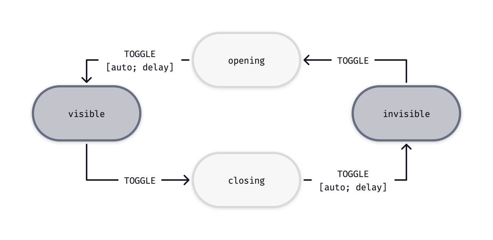
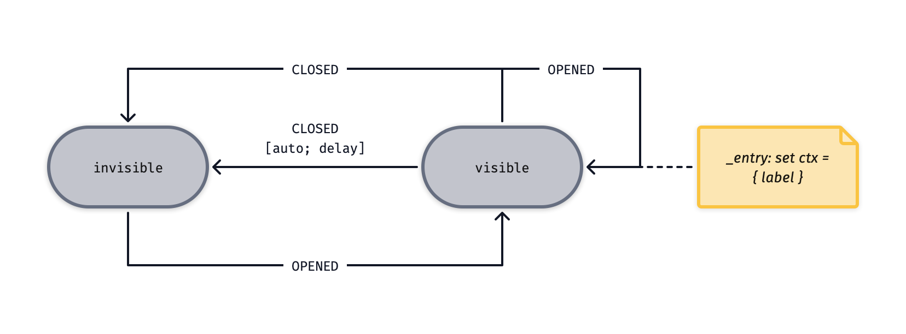
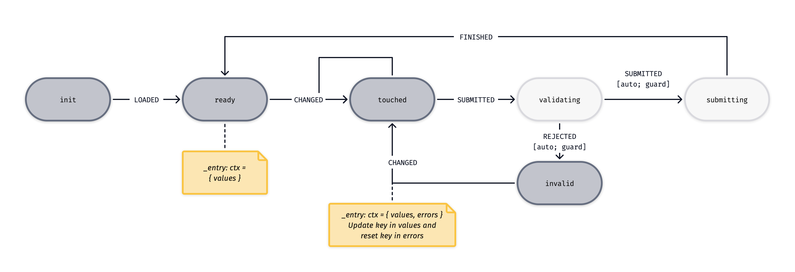
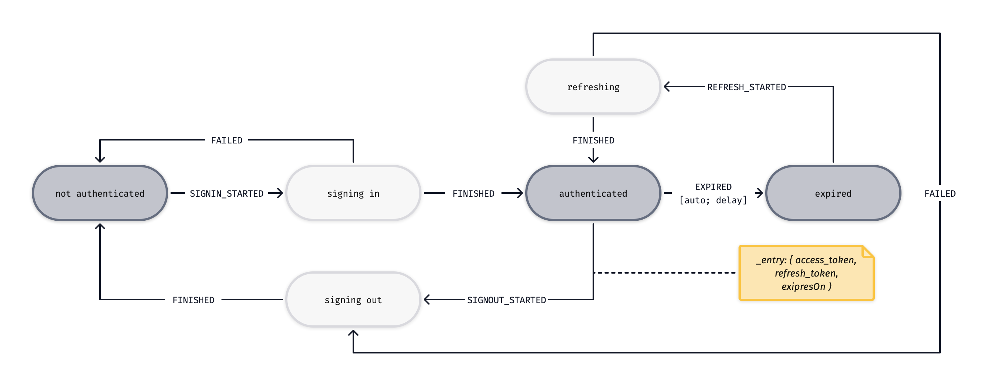

# Examples

## Fetching data


This state machine allows you to maintain the state of a single fetch operation (e.g. GET/POST). The context of the machine holds the data/errors (response) of the fetch, and can be used to show this information on the screen. It can be combined with caching, where each url you try to fetch is the key in the cache, and the corresponding state machine the value in the cache. By triggering the `MODIFIED` event, the cache is flagged as `invalid`, allow correct data refreshing strategies.

```js
// ACTIONS
const successEntry = (_s, ctx, values) =>
  assign({ ...ctx, data: values, errors: null, valid: true });

const errorEntry = (_s, ctx, values) =>
  assign({ ...ctx, errors: values, data: null, valid: false });

const pendingEntry = (_s, ctx) => assign({ ...ctx, errors: null });

const invalidEntry = (_s, ctx, values) =>
  assign({
    ...ctx,
    data: {
      ...ctx.data,
      [values.key]: values.value,
    },
    valid: false,
  });

// CONFIG
const config = {
  idle: { STARTED: 'pending' },
  pending: { FINISHED: 'success', FAILED: 'error', _entry: [pendingEntry] },
  success: { STARTED: 'pending', MODIFIED: 'invalid', _entry: [successEntry] },
  invalid: { MODIFIED: 'invalid', _entry: [invalidEntry] },
  error: { STARTED: 'pending', _entry: [errorEntry] },
};

// EXAMPLE USAGE
machine.send('FINISHED', data);
machine.send('FAILED', errors);
machine.send('MODIFIED', { key: 'test', value: 'test' });
```

## Offscreen UI elements



Think of modals, sidebars, etc. that you want to appear/dissappear on the screen. This state machine takes into account that the element might have a transition state in which animations etc. happen.

```js
import { send } from '@crinkles/fsm';

// ACTIONS
const toggling = (_s, ctx) => send('TOGGLE', ctx, 10);

// CONFIG
const config = {
  visible: { TOGGLE: 'closing' },
  closing: { TOGGLE: 'invisible', _entry: [toggling] },
  invisible: { TOGGLE: 'opening' },
  opening: { TOGGLE: 'visible', _entry: [toggling] },
};
```

## Toasts



Toast messages are a special kind of offscreen UI element. Once appeared, they will automatically disappear, unless they are triggered again. Manual closing of the toast message should also be possible. The context of the machine Note that this machine does not have transitional states for animation purposes.

```js
import { assign, send } from '@crinkles/fsm';

// CONFIG
const config: Record<string, State<Context>> = {
  visible: {
    CLOSED: 'invisible',
    OPENED: 'visible',
    _entry: [
      (_s, ctx, values) => assign({ ...ctx, ...values }),
      (_s, ctx) => send('CLOSED', ctx, 6000),
    ],
  },
  invisible: { OPENED: 'visible' },
};

// EXAMPLE USAGE
machine.send('OPENED', { label: 'my toast message' });
```

## Forms



```js
import { send, assign } from '@crinkles/fsm';

// ACTIONS
function validator(ctx) {
  if (ctx.values.key === 'test') return {};
  return { key: 'required' };
}

function isValid(ctx) {
  const _res = validator(ctx);
  if (Object.keys(_res).length === 0) return true;
  return false;
}

function updateEntry(_s, ctx, values) {
  const _ctx = { ...ctx };
  const _values = values;
  _ctx.values[_values.key] = _values.value;
  _ctx.errors[_values.key] = '';
  return assign(_ctx);
}

function validationAction(_s, ctx) {
  if (isValid(ctx)) return send('SUBMITTED');
  else return send('REJECTED', validator(ctx));
}

// CONFIG
const config = {
  init: { LOADED: 'ready' },
  ready: {
    CHANGED: 'touched',
    _entry: [(_s, _ctx, values) => assign({ values: values, errors: null })],
  },
  touched: {
    CHANGED: 'touched',
    SUBMITTED: 'validating',
    _entry: [updateEntry],
  },
  validating: {
    SUBMITTED: { target: 'submitting', guard: isValid },
    REJECTED: { target: 'invalid', guard: (ctx) => !isValid(ctx) },
    _entry: [validationAction],
  },
  invalid: {
    CHANGED: 'touched',
    _entry: [(_s, ctx, values) => assign({ ...ctx, errors: values })],
  },
  submitting: { FINISHED: 'ready' },
};

//EXAMPLE USAGE
machine.send('CHANGED', { key: 'test', value: 'test' });
```

## Object state


By storing the actual state of an object, you can use the state of the object to disallow features, or rendering of elements, client-side. In addition, you can ensure optimistic UI is applied according to the available state machine corresponding to the object.

```js
const config = {
  draft: { SUBMIT: 'pending' },
  pending: { APPROVE: 'approved', REJECT: 'rejected' },
  approved: { REJECT: 'rejected', PROCESS: 'processed' },
  rejected: { SUBMIT: 'pending' },
  processed: {},
};

function approve() {
  if (machine.current !== 'pending') return;
}
```

## Authentication



Authentication

```js
import { send } from '@crinkles/fsm';

const config = {
  not_authenticated: { SIGNIN_STARTED: 'signing_in' },
  signing_in: { FINISHED: 'authenticated', FAILED: 'not_authenticated' },
  authenticated: {
    SIGNOUT_STARTED: 'signing_out',
    EXPIRED: 'expired',
    _entry: (_s, ctx) => send('EXPIRED', ctx, 90000),
  },
  expired: { REFRESH_STARTED: 'refreshing' },
  signing_out: { FINISHED: 'not_authenticated' },
  refreshing: { FINISHED: 'authenticated', FAILED: 'signing_out' },
};
```
